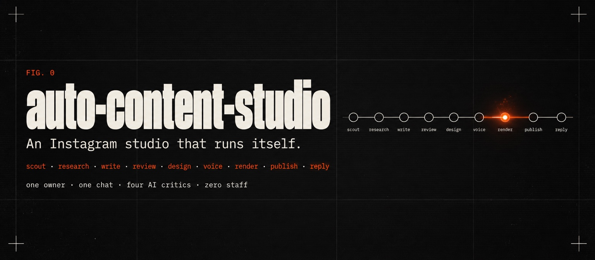
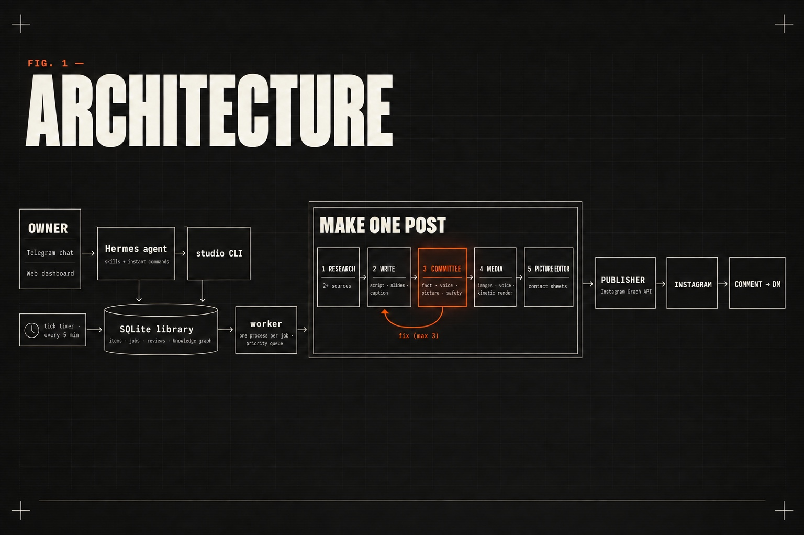
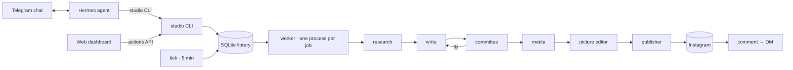
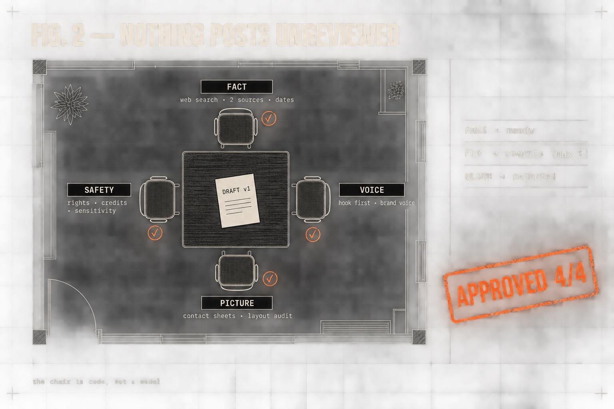
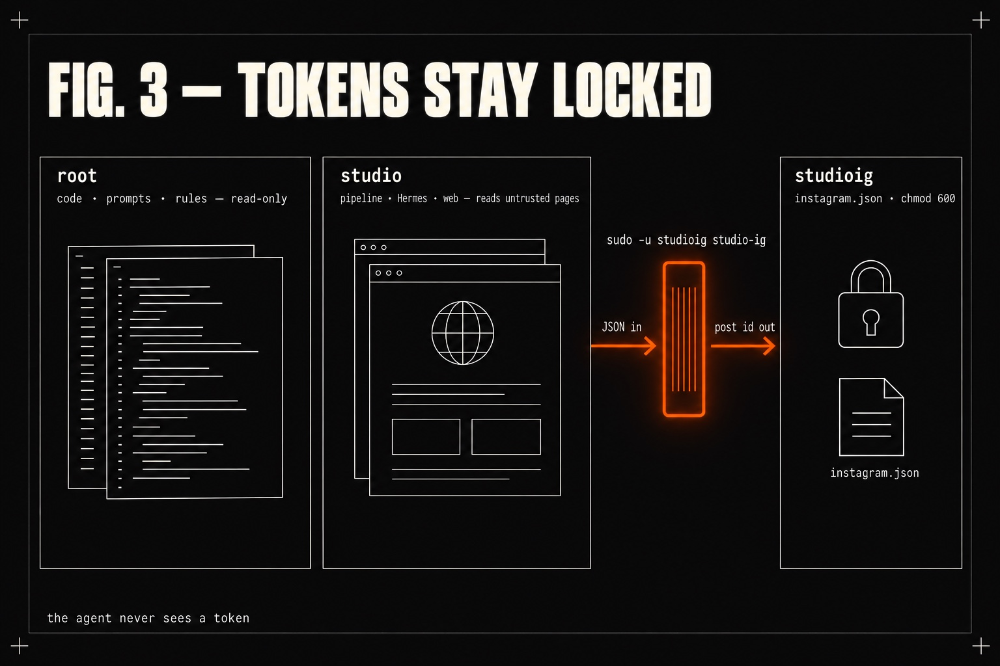
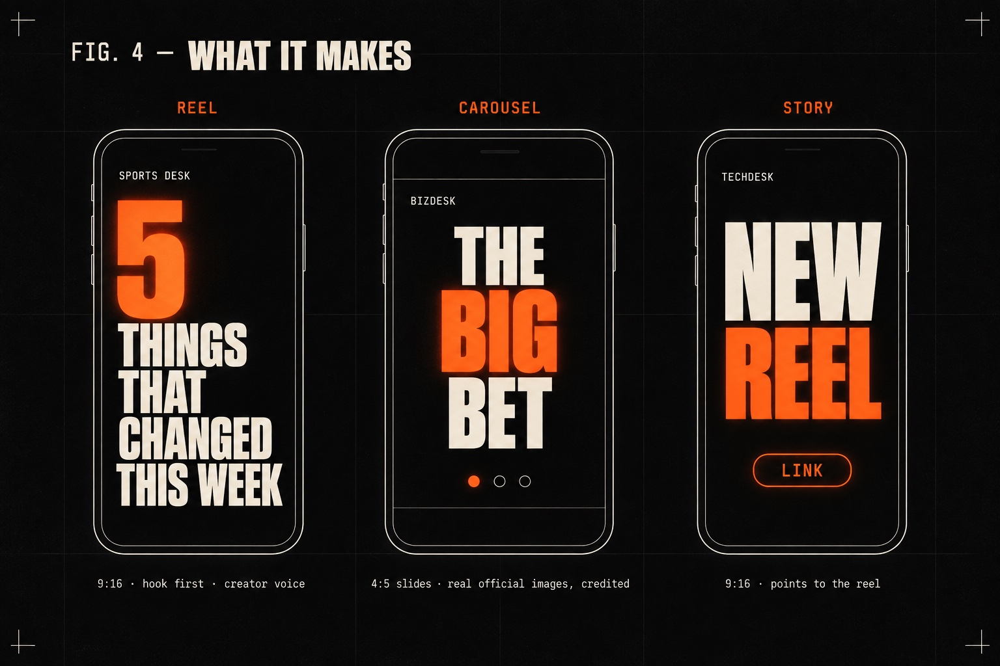
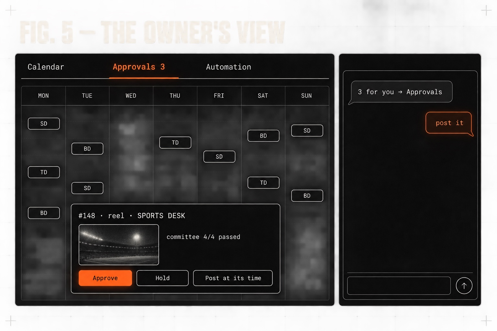

<p align="center"></p>

<p align="center">
  <b>Scout · research · write · review · design · voice · render · publish · reply</b><br>
  A fully automated Instagram content studio, run by one person from a chat.
</p>

<p align="center">
  <a href="#how-a-post-gets-made">How it works</a> ·
  <a href="#nothing-posts-unreviewed">The committee</a> ·
  <a href="#tokens-stay-locked">Security</a> ·
  <a href="#what-it-makes">Output</a> ·
  <a href="#the-owners-view">Operating it</a> ·
  <a href="docs/SETUP.md">Setup</a>
</p>

---

One owner texts ideas to a chat bot (or nothing at all). The studio scouts the news, researches every claim against two
real sources, writes in each brand's voice, designs the images, records a creator-style voiceover, renders kinetic reels,
puts every draft in front of a committee of four AI critics, schedules, publishes to several Instagram accounts — and
answers comments with DMs.

It runs on one small Linux server. **This repo is the code base only:** no accounts, tokens, handles or media. The three
brands in `studio/config.py` (SPORTS DESK, TECHDESK, BIZDESK) are examples — replace them with your own.

## How a post gets made



| Stage | Where | What happens |
| --- | --- | --- |
| **Plan** | `cli.py plan · today · scout` | A week plan per brand from cadence + posting slots, "N more posts today", or web-scouted ideas that wait for the owner's "yes". |
| **Research** | `pipeline.py`, `prompts/research.md` | Live web research. Every claim needs two independent sources, official pages first; the latest season's data only. |
| **Write** | `prompts/reel.md · carousel.md · news-carousel.md · rules.md` | The frozen house format: the hook in the first second, then the brand greeting, list-style scripts, a comment-to-DM call to action, credited captions. |
| **Review** | `committee.py`, `prompts/committee.md` | Four independent critics — see below. A *fix* goes back to the writer (max 3 rounds), a *block* rejects. |
| **Media** | `assets.py`, `newsdeck.py`, `deploy/codex-image.sh` | Designed slides are generated whole, text included; news carousels place **real official images pixel-true** and wrap them in generated panels; official logos only, credited. |
| **Memory** | `graph.py` | A knowledge graph of every entity, image, licence, fact and post — logos, press images and verified facts are reused, never re-fetched. |
| **Voice & reels** | `tools/kinetic/` | A local TTS creator voice with per-brand direction, then a kinetic-typography reel from a layout-audited spec, rendered with HyperFrames in headless Chrome. |
| **Motion** | `animate.py` | Optional per-slide animation for carousels: an empty plate + the design → element entrances → short video slides. |
| **Publish** | `ig.py`, `deploy/igcli.py` | Instagram API with Instagram Login, through a locked-down helper (below). |
| **Engage** | `dm.py` | A comment with the post's keyword gets one private-reply DM and a public "check your DMs". |
| **Run** | `cli.py worker`, `deploy/*.service` | A dispatcher runs every job in its own process (priority → due soon → format); CPU-heavy voice and render steps take turns; systemd timers drive the rest. |

<details>
<summary>The same flow as a text diagram</summary>


</details>

## Nothing posts unreviewed



Each critic is a separate model call with its own brief:

- **FACT** — a fact-checker with live web search: numbers, names, dates, two sources, freshness.
- **VOICE** — the brand and script editor: the hook, the greeting, the frozen format, the caption lines.
- **PICTURE** — the picture editor: contact sheets of every reel, every slide, plus the render engine's layout audit.
- **SAFETY** — standards and legal: defamation, sensitive events, image rights, required credits.

The chair is plain code: any **block** → rejected; any **fix** → the writer revises with every note (at most 3 rounds);
all **pass** → ready. Approval modes: `veto` (the owner gets a preview and it posts unless held), `auto`, `manual`.
The owner can always override.

## Tokens stay locked



The chat agent reads untrusted web pages all day, so it must never be able to reach the account tokens:

- `root` owns the code, prompts and rules — read-only to everything else.
- `studio` runs the pipeline, the agent and the web actions.
- `studioig` alone can read `secrets/instagram.json` (mode 600). The only way in is one sudo rule for one helper
  (`deploy/studio-ig`) that takes a JSON request on stdin and returns a post id — the agent never sees a token.

## What it makes



- **Reels** (9:16): hook first, a creator voice, kinetic type with real stickers, fast cuts, a tap-to-follow outro.
- **Carousels** (4:5): designed slides, or news slides built around real official images — every image credited.
- **Stories** (9:16): shares that point to the day's reel or carousel.

## The owner's view



- **Dashboard** (`dashboard.py`, rebuilt every minute): the week calendar, a preview page per post, an **Approvals** tab
  with a time picker, priority controls, and an **Automation** tab with every timer, scout run and pitch.
- **Chat** (Hermes + `skills/`): plain language — *"20 posts today"*, *"scout cricket"*, *"move #148 to 7 pm"* — plus
  instant zero-token commands (`/pause`, `/approvals`, `/queue`, `/today`, `/scout`).
- **Quiet by design**: the chat stays the owner's. The studio sends one batched "N for you → Approvals" link at most
  every 20 minutes, and a morning nudge — never a message per post.

## Repository layout

```
studio/          the Python package: CLI, pipeline, committee, graph, publisher, DMs, dashboard, actions API
prompts/         researcher, writer, planner, scout and committee prompts (the house style lives here)
skills/          agent skills for Hermes (operator, scout, week plan, intake, rules, debug)
deploy/          setup.sh, systemd units, Caddyfile, the Instagram helper + its sudo rule, the Hermes plugin
tools/kinetic/   the kinetic reel builder (spec → layout audit → HyperFrames render), TTS adapters, editing rules
docs/            SETUP.md and the images in this README
```

## Getting started

You need a Linux server (4 vCPU / 16 GB is plenty), Python 3.12 with `uv`, Node 20+, ffmpeg, Caddy, a professional
Instagram account per brand connected to a Meta app (*Instagram API with Instagram Login*), a Telegram bot, the Hermes
agent for chat control, and a Codex CLI login for text and image generation (the model calls go through `studio/llm.py`,
so another provider can be swapped in there).

Step-by-step: **[docs/SETUP.md](docs/SETUP.md)**. Config templates: `.env.example`, `secrets/instagram.example.json`.

```bash
studio check            # accounts, token expiry, quota, disk, services
studio plan --days 7    # book a week for every brand
studio status           # what's due, making, ready
```

## Licence

MIT — see [`LICENSE`](LICENSE). Fonts, emoji, sound effects and brand artwork are not included — see
[`tools/kinetic/ASSETS.md`](tools/kinetic/ASSETS.md). The illustrations in this README were generated with Codex image
generation.
