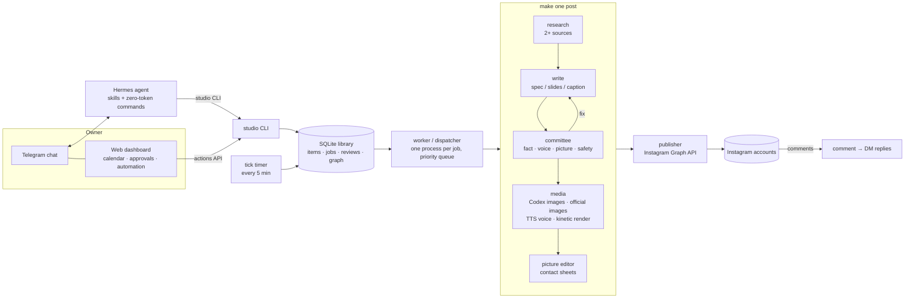

# auto-content-studio

A fully automated Instagram content studio: one person texts ideas (or nothing at all) to a chat bot, and the studio scouts
the news, researches it against real sources, writes, designs, voices, renders, reviews with a committee of four AI critics,
schedules and publishes reels, carousels and stories across several brand accounts — and answers comments with DMs.

It runs on one small Linux server. This repo is the code base only: no accounts, tokens, handles or media. The three brands in
`studio/config.py` (SPORTS DESK, TECHDESK, BIZDESK) are examples — replace them with your own.



## What it does

| Stage | Module | How |
| --- | --- | --- |
| Plan | `cli.py plan / today / scout` | A week plan per brand (cadence + posting slots), "N more posts today", or web-scouted ideas that wait for a "yes". |
| Research | `pipeline.py` + `prompts/research.md` | Live web research; every claim needs two independent sources, official pages first; freshness rules (latest season's data). |
| Write | `prompts/reel.md`, `carousel.md`, `news-carousel.md`, `rules.md` | The frozen format: hook in the first second, then the brand greeting, list-style scripts, a comment-to-DM call to action, captions with credits. |
| Review | `committee.py` + `prompts/committee.md` | Four independent critics (fact-checker with web search, brand/script editor, picture editor, standards & legal). Any *block* rejects; any *fix* sends it back to the writer (max 3 rounds). The owner can override. |
| Images | `assets.py`, `newsdeck.py`, `deploy/codex-image.sh` | Designed slides are generated whole (text included) by an image model; news carousels place REAL official images pixel-true and wrap them in generated text panels; official logos only, credited; open-licence photos with credits. |
| Knowledge graph | `graph.py` | Every entity, image, licence, fact and post is linked, so logos, press images and verified facts are reused, never re-fetched. |
| Voice & reels | `tools/kinetic/` (`kreel.py`, `voice_qwen.py`) | A local TTS creator voice with per-brand direction, then a kinetic-typography reel built by a layout-audited spec and rendered with HyperFrames (headless Chrome). |
| Motion carousels | `animate.py` | Optional per-slide animation: an empty plate + a design diff → element entrances → short H.264 clips (Instagram accepts video carousel children). |
| Publish | `ig.py`, `deploy/igcli.py`, `deploy/studio-ig` | Instagram API with Instagram Login. Tokens live in a file only a dedicated system user can read, through one sudo rule — the agent and the web never see them. |
| Engage | `dm.py` | Comments with the post's keyword get one private-reply DM and a public "check your DMs". |
| Operate | `dashboard.py`, `webapi.py`, `tg.py`, `deploy/hermes-plugin/` | A static dashboard rebuilt every minute (calendar, previews, approvals with a time picker, priority, automation), a tiny actions API, and a quiet Telegram channel: one batched "N for you → approvals" link instead of a message per post. |
| Run | `cli.py worker`, `deploy/*.service` | A dispatcher runs each job in its own process (priority → due soon → format), with flock-based turns for the CPU-heavy voice and render steps; systemd timers drive `tick` and the dashboard. |

## Design choices worth stealing

- **Nothing posts unreviewed.** The chair of the committee is code, not a model: block → rejected, fix → rewrite, all pass →
  ready. Approval modes: `veto` (preview, posts unless held), `auto`, `manual`.
- **Least privilege around tokens.** The chat agent reads untrusted web pages, so it runs as a user that cannot read the
  Instagram tokens; publishing goes through a single sudo-able helper that only accepts a JSON request.
- **Real images stay real.** Generated art is for design; faces, screenshots and products come from official sources, placed
  pixel-true, never redrawn. Everything used is credited, and its licence is recorded in the graph.
- **Quiet by default.** The owner's chat stays theirs: the studio sends one batched approvals link at most every 20 minutes,
  and a morning nudge.
- **One process per job.** Reloading code never drains the queue; crashed jobs are recovered on start.

## Layout

```
studio/          the Python package (CLI, pipeline, committee, graph, publisher, dashboard, API)
prompts/         the writer, researcher, planner, scout and committee prompts (the house style lives here)
skills/          agent skills for Hermes (operator, scout, week plan, intake, rules, debug)
deploy/          setup.sh, systemd units, Caddyfile, the Instagram helper + sudoers rule, the Hermes plugin
tools/kinetic/   the kinetic reel builder (spec → layout audit → HyperFrames render), TTS voices, editing rules
docs/SETUP.md    how to stand it up on a server
```

## Requirements

A Linux server (4 vCPU / 16 GB is enough), Python 3.12 with `uv`, Node 20+ (HyperFrames), ffmpeg, Caddy, an Instagram
professional account per brand connected to a Meta app (Instagram API with Instagram Login), a Telegram bot, the
Hermes agent (Nous Research) for chat control, and a Codex CLI login for text + image
generation (the LLM calls go through `studio/llm.py`, so another provider can be swapped in there). See `docs/SETUP.md`.

## Licence

MIT — see `LICENSE`. Fonts, emoji, sound effects and brand artwork are not included; see `tools/kinetic/ASSETS.md`.
